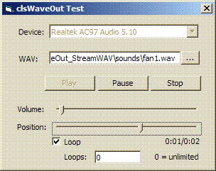



## WaveOut Streaming

### Description

Update (28.10.06): Added support for looping, fixed some small bugs, added a new class "WAVPlayer" which simplifies streaming playback a lot. 

----

Shows how to stream sound data to the WaveOut.

Supports the WAV file format and the ACM (audio compression manager), to handle compressed WAV formats. Uses Paul Catons subclassing code.

I tried to keep it as reusable as possible,

so there are 2 classes: One reads (or decodes) data from WAV files, and one sends it to the WaveOut.
 
### More Info
 

             |
---                |---
**Submitted On**   |2006-10-28 01:27:06
**By**             |[Arne Elster](https://github.com/Planet-Source-Code/PSCIndex/blob/master/ByAuthor/arne-elster.md)
**Level**          |Advanced
**User Rating**    |4.9 (64 globes from 13 users)
**Compatibility**  |VB 6\.0
**Category**       |[Sound/MP3](https://github.com/Planet-Source-Code/PSCIndex/blob/master/ByCategory/sound-mp3__1-45.md)
**World**          |[Visual Basic](https://github.com/Planet-Source-Code/PSCIndex/blob/master/ByWorld/visual-basic.md)
**Archive File**   |[WaveOut\_St20274210282006\.zip](https://github.com/Planet-Source-Code/arne-elster-waveout-streaming__1-66866/archive/master.zip)

